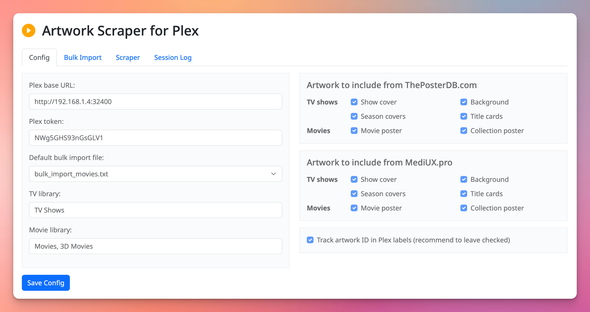
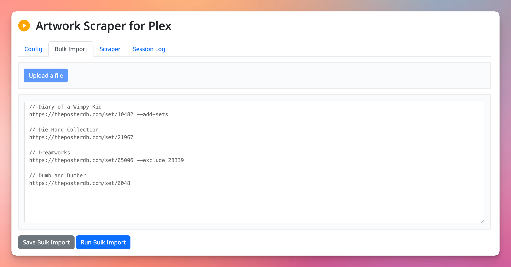
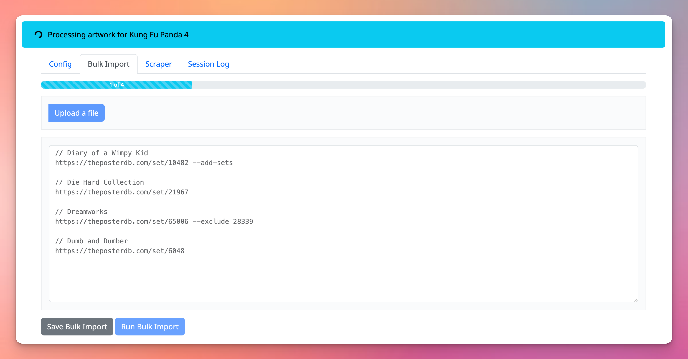
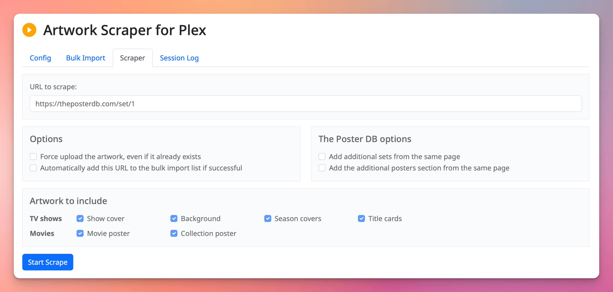
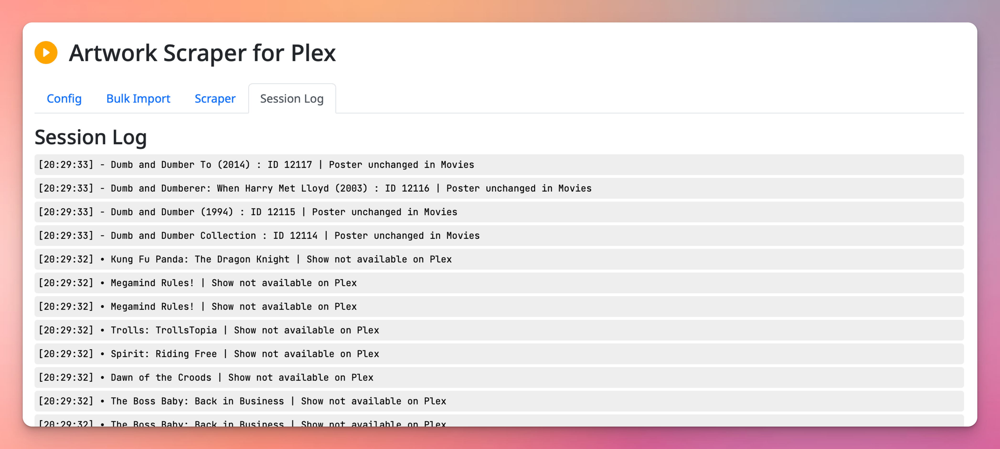

# Artwork Uploader for Plex 
Adapted from a fork of plex-poster-set-helper by Brian Brown

Artwork Uploader is a tool to help upload sets of posters from ThePosterDB or MediUX or scrape posters from MediUX and upload them to your Plex server in seconds!

# What's different from Brian's original app?
### Upload Zip files
You can upload the Zip file you download from theposterdb.com or mediux.pro.  It should handle all types of Zip, including the odd misnamed file from MediUX.  This feature is still in Beta so help me out with some feedback here!
This is also to keep theposterdb happy that we're not breaking their terms of service by scraping.

### Artwork tracking for speedy updates
We (optionally) store an artwork ID in a Plex label against each movie, show, episode and collection, so it can check whether the same artwork is about to be uploaded again.  If it detects the same artwork has been requested, it'll skip it, resulting in a quicker run time.  

### Force artwork to be updated
If you really want to upload artwork again, use the ```--force``` option at the command line, in the bulk file, or when entering the URL in the Web UI.

### ThePosterDB scraping
There are also a couple of new options for thePosterDb, which will allow you to also grab additional sets and additional posters from the same page.  This is sometimes useful for big sets like the Marvel or Disney movies, where you'll otherwise need to specify multiple sets.  This is against the terms of service of theposterdb.com so we encourage you to login, download the files you want, and upload them using this tool, rather than scraping.  Once an API is available we'll switch over ASAP.

### Per-URL filtering and artwork excludes 
And there are other options such as per-URL filtering, fixing missing things that I found while I was using the tool (where I wanted to apply episode title cards but didn't like the season artwork for example).  And if you don't like a particular piece of artwork or poster from a set, you can now exclude it.

### Year matching
Sometimes the year on Plex and the year at the artwork provider is different.  Use the --year <year> argument to set the Plex year, so the artwork matches.  Also available in the Web UI and bulk files.

### Clean up your bulk files
Plus you can allow your bulk file to be auto-managed (cleaned and sorted for you).  It's not really production ready yet but works just fine I think - do let me know!

### Web UI
Oh, last but not least, there's now a shiny new web UI so you can leave it running on your Plex Server and access it remotely!


### Scheduler
Basic scheduler, so that you can leave this running and update all your artwork every day. 

The basic version is available now on the bulk imports page, click on the clock to enable or disable per file.  

It's there for when we have API access (and works for scrapers in the meantime) but is limited to running once a day which should be fine.

## Coming soon
- API integration with MediUX so we don't need to scrape any more.  I've been in contact with them to get access to the API as soon as it's launched.

## Thanks
Many thanks to Brian Brown [@bbrown430] (https://github.com/bbrown430) for the original plex-poster-set-helper - what a fantastic idea!  It's saved me a load of time, and it's made my Plex beautiful!  And it's made me learn a bit of Python too!  I really hope you don't mind me taking your work and running with it, please get in touch if you'd like to merge the two projects!

## Disclaimer
This is a first project for me, i'm using it to learn Python so it will be constantly changing as I learn more.  I therefore don't offer any support further than my own knowledge, or any guarantee that it will actually work!  Any help would be appreciated, so feel free to contribute.   I am also aware that scraping breaks the terms of service of TPDb so please consider using the upload Zip feature from there.  Wish these sites had APIs!

---
# Installation

### 1. Install Python
[Install Python](https://www.python.org/downloads/) (if not installed already).  You'll need version 3.10 or later.

### 2. Get Artwork Uploader for Plex
Either download the Zip and extract all files into a folder, or Git Clone the repository

### 3. Open a terminal 
Then CD to the folder where you extracted Artwork Uploader

### 4. Install the required dependencies

```bash
   pip install -r requirements.txt
   ```

You may need to use ```python3 -m pip install -r requirements.txt```

### 5. Rename ```example_config.json``` to ```config.json```.  
This is optional - if you don't do this, a new config.json will be created when you first run the utility and you'll be prompted to edit the config.

### 6. Edit your config.json to provide the following information:  

```"base_url"```  
- The IP address (and port) of your Plex server. e.g. "http://12.34.56.78:32400/".

```"token"```  
- Your Plex token (can be found [here](https://support.plex.tv/articles/204059436-finding-an-authentication-token-x-plex-token/)).

```"tv_library"``` 
- The name of your TV Shows library (e.g., "TV Shows"). Multiple libraries are also supported (see the **Multiple Libraries** section below).

```"movie_library"```  
- The name of your Movies library (e.g., "Movies"). Multiple libraries are also supported (see the **Multiple Libraries** section below).

```"mediux_filters"```
- See the list of filter options below.  Anything not in this list will not be uploaded unless requested in the command line, in the bulk file or in the scraper URL in the Web UI.

```"tpdb_filters"```
- See the list of filter options below.  Anything not in this list will not be uploaded unless requested in the command line, in the bulk file or in the scraper URL in the Web UI.

```"track_artwork_ids"```
- Setting this to ```true``` will result in speedy scraping re-runs.  It uses Plex labels to store a special ID for the artwork, so that next time, we can check if the scraped artwork is the same as the current artwork and skip re-uploading.
- By setting this to ```false```, it'll upload every artwork every time you run (like using the --force option for every item).  This can result in long run-times, especially if you're using ThePosterDB.  We recommend you leave this as **true** and use --force when you need to!

```"auto_manage_bulk_files"```
- Setting this to ```true``` will automatically add, label and sort URLs from the scrape tab into the currently loaded bulk import file.  At the moment it won't auto-save, but I might add that later.
- Setting to ```false``` will leave the organisation of your bulk files up to you.
   
### Filter options
Both mediux_filters and tpdb_filters specify which artwork types to upload by including the flags below.  Specify one or more in an array ["show_cover, "title_card"]
      - show_cover
      - background
      - season_cover
      - title_card
      - movie_poster
      - collection_poster

---
# Usage

## Docker 

If you want to use docker, there is a Dockerfile in the repo to allow it to be deployed in a cotnainer allongside a plex container. 

Clone the repository and use the `docker-compose.yml` file to deploy it with docker compose. Or copy this block in a `docker-compose.yml` file pointing to the location of the repository to build the image instead of the `.` 

```yaml
services:
  artwork_uploader:
    build: .
    ports:
      - "4567:4567"
    volumes:
      - ./bulk_imports:/artwork-uploader/bulk_imports
      - ./config.json:/artwork-uploader/config.json
    environment:
      - PYTHONUNBUFFERED=1
```

And run 
```bash
docker compose up -d
```

## Directly as a python script

**NOTE**: THIS REQUIRES AT LEAST PYTHON 3.10.  You will encounter odd errors in the scraping log for earlier versions of Python, due to a bug that was fixed in 3.10.

### In a terminal
``` bash
    python artwork_uploader.py
```
**NOTE**: You may need to use ```python3``` rather than ```python```, especially Mac users).

With no arguments, Artwork Uploader will start a webserver on port 4567 (this may change!)

## Command Line Arguments

The script supports various command-line arguments for flexible use.

### 1. Single link import  
   Provide a link directly to set posters from a single set of posters:
   
```bash
   python artwork_uploader.py https://mediux.pro/sets/9242
   
   or, depending on your environment
   
   python3 artwork_uploader.py https://mediux.pro/sets/9242
   
```
#### Optional command line arguments

```--add-sets``` will also parse any additional sets when using the Poster DB 
    
```--add-posters``` will also parse the additional posters section of the set, when using the Poster DB
   
```--force``` will force the artwork to be updated even if it's the same as the one on plex already - or maybe you changed the artwork manually and want to override it...
    
```--exclude <id1> [<id2> <id3> ...]``` will exclude the poster or artwork with the specified ID from being uploaded.  Grab the ID from the session log...
- ThePosterDB is a number
- MediUX is a UUID
    
```--filters <filter1> [<filter2> <filter3> ...]``` will **only** upload the selected artwork types, based on the options below
- show_cover
- background
- season_cover
- title_card 
- movie_poster
- collection_poster
    
```--year <year>``` will override the year that it will look for in Plex.  Sometimes the year in Mediux or TPDb doesn't match the year of the show or movie in Plex, therefore won't update the artwork.  Use this option with the year in Plex to force a match.  Will be ignored in bulk mode, where you should specify this on a per-line basis.

### Using these options in files and GUI

   These options can also be used in the URL scraper GUI, and in your bulk file, just add them straight after the URL in each line, for example 
   ```
   https://theposterdb.com/set/71510 --add_posters --force
   ```

## Bulk Files
   Import multiple links from a .txt file using the bulk argument:
   
```bash
   python artwork_uploader.py bulk bulk_import.txt
   ```

   - The .txt file should contain one URL per line. Lines starting with # or // will be ignored as comments.

   - **If no text file parameter is provided, it will use the default value from config.json for bulk_txt.**

---
# Other features

## Web UI
It's still work in progress, as is this entire app!  I wouldn't consider it "production" ready but it's fully functional!








## Multiple Libraries

To target multiple Plex libraries, modify config.json as follows:

```json
"tv_library": ["TV Shows", "Kids TV Shows"],
"movie_library": ["Movies", "Kids Movies"]
```

Using these options, the tool will apply artwork to the same media in all specified libraries.

## Bulk Import

1. Use the bulk argument to import your default `bulk_text` file specified in `config.json`.
2. Or, specify the path to a .txt file containing URLs as a second argument. Each URL will be processed to set the artwork for the corresponding media.

## Filters

Both the ```mediux_filters``` and ```tvdb_filters``` options in **config.json** allows you to control which artwork types are uploaded to Plex on a global level.  You can also set these global filters in the GUI and in the Web UI.

```show_cover``` - Upload a cover for the TV show

```background``` - Upload background images

```season_cover``` - Upload covers for each individual season

```title_card``` - Upload title cards for individual episodes

```movie_poster``` - Upload posters for movies

```collection_poster``` - Upload posters for collections

### Using the above filters 
#### These filters can be used from many places...
- In ```config.json```, which will apply filters globally for each provider.  
- These options can also be set from the Web UI

### The global filters can then be overridden on a per-URL basis...

- On the command line, by using ```--filters <filter1> [<filter2> <filter3>...]```
- After the URL in a bulk file using the same format as you would on the command line
- After the URL in the Bulk Import tab of the Web UI or local GUI using the same format as you would on the command line
- In the scraper tab in the Web UI, where you can simply check boxes to set options and filters.

